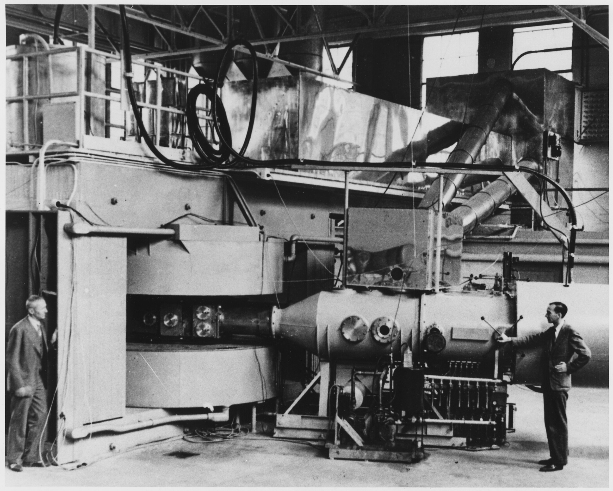
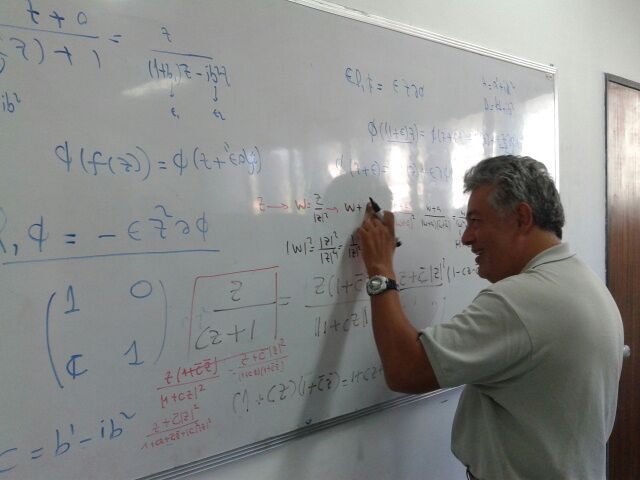

  <H1> Physics is Fun </H1>

  
  
  

## Description

Driven by a lifelong fascination with physics that ignited at the tender age of seven through countless hours of watching science documentaries, I embarked on a journey to become a "Mad Scientist." This journey culminated in becoming a full professor of physics at Universidad Simón Bolívar in Caracas, Venezuela, in 2003.

To share this enduring passion and knowledge, I've created this repository. Its primary functions are twofold. First, I aim to foster physics education and outreach by curating and sharing diverse video resources, including YouTube segments of lectures, experiments, full-length documentaries, and animations. These resources will be complemented by book and lecture note references. Second, I provide tools and resources for algebra-based physics, designed to support high school students and independent learners. These tools include personal notes and Python notebooks for simulations, data analysis, and problem-solving.  

## Notes
[xxxxx](pics/Hawking_in_Zero_Gravity_NASA.jpg) como texto principal 
