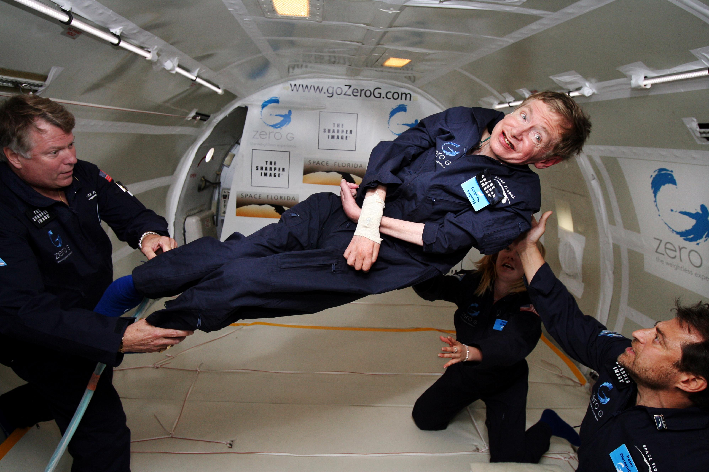

  
  

  <H1> Physics is Fun </H1>

## Description

My purpose with this repo is to share my love for physics.   [J. D. Jackson](https://en.wikipedia.org/wiki/Classical_Electrodynamics_(book)) como texto principal 
