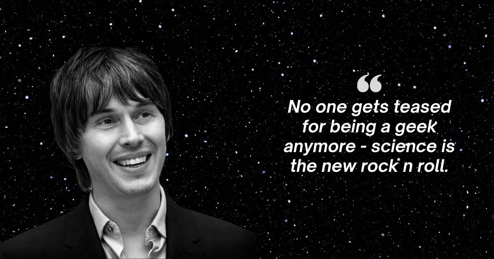

  
  

  <H1> Physics is Fun </H1>

## Descripción

Este curso, de dos partes (dos trimestres) estudia los principio básicos de la teoría electromagnética. Como ocurre en muchas instituciones alrededor del mundo, el curso
utiliza el libro de [J. D. Jackson](https://en.wikipedia.org/wiki/Classical_Electrodynamics_(book)) como texto principal 
